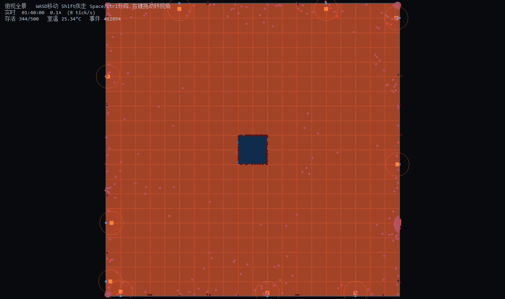
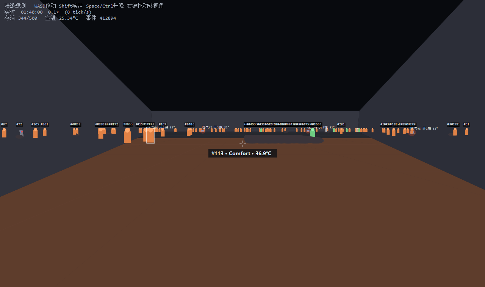

# 500 个白痴

一个**观察性仿真**：100 m × 100 m 的房间，500 个编号 1–500 的白痴，智力相当于 3 岁儿童。
室温 15 °C。屋里散落着 10 台电暖气、10 块木板、10 根木棍、10 根铁钉、若干杂草，
以及 400 个老式双圆孔插座（右孔火线、左孔零线），中央是一个 10 m 见方的水池。

他们没有说明书，事先不知道任何规则，只能靠**试错**和**看别人试错**来学习。

你要观察的是三件事：

| 里程碑 | 含义 |
|---|---|
| **G1** | 他们什么时候发现怎么让电暖气转起来 |
| **G2** | 什么时候第一次钻木取火成功 |
| **G3** | 房间什么时候变得足够暖和 |

完整规格与设计推导见 **[design.md](design.md)**。

---

## 架构

刻意**不依赖 Unity**——整个模拟是纯 C#，零引擎依赖，因此可以无头批量跑、可以确定性复现。

```
src/Sim/       纯 C# 仿真内核（net8.0，零 UnityEngine 依赖）
  Core/        Rng（xorshift128）、Vec2、SpatialGrid
  World/       Arena（房间/水池/墙）、Entity（插座/电暖气/木板/木棍/铁钉/杂草）
  Agents/      Agent 状态机与身体模型
  Knowledge/   信念系统（置信度、实例绑定、衰减）
  Recording/   EventLog —— 每一次尝试、每一个结果都落盘
  Simulation.*.cs
               .cs        世界推进
               .Brain.cs  感知 + 效用决策（无规划器，只对候选动作打分）
               .Actions.cs 动作结算
               .Observe.cs 观察学习与传播

src/Viewer/    WinForms + GDI+ 软件渲染观测台
  SceneView.cs     针孔投影 / 近平面裁剪 / 画家算法的软件 3D
  MainForm.cs      漫游 / 俯视 / 跟随三种视角，时间轴拖动回看
  InspectorPanel.cs 单个白痴的档案：身体状况、道具尝试记录
  Headless.cs      无头批量验证（不依赖任何 UI）
  Shot.cs          批量出图
```

### 几个值得说明的设计点

**没有规划器。** 白痴不做搜索、不做前瞻，只有一组效用函数给候选动作打分
（`BuildCandidates` → 上限 28 个候选 → 取分最高）。"智力 3 岁"在实现上就等于
"只看眼前这一步，且会算错"。

**知识是实例绑定的，泛化很慢。** 亲眼成功的经验绑在**那一个**插座上；
只有反复验证或从别人那里听说，才会泛化成"左孔安全"这条通用规则。

**观察学习有三层失真**（design.md §4.5）：旁观者按清晰度以一个概率记反左右；
归因错误会制造民间迷信（"铁钉有毒"）；过度泛化会让被烫过的白痴**连火堆也不敢靠近**。

**确定性是硬约束。** 不用 `System.Random`，不用 `DateTime.Now`，
每个白痴一条独立的 xorshift128 流。同一个 seed 跑两遍，结果逐字节一致
（唯一不同的是报告里的墙钟计时行）。

---

## 构建与运行

需要 .NET SDK 8.0。

```powershell
# 直接跑（开发）
dotnet run --project src\Viewer\Viewer.csproj

# 无头批量仿真（不开窗，跑完打印报告并写 headless-report.txt）
dotnet run --project src\Viewer\Viewer.csproj -- --headless --minutes 1440 --quiet

# 发布单文件自包含 exe（约 138 MB，目标机器无需装 .NET）
dotnet publish src\Viewer\Viewer.csproj -c Release -r win-x64 --self-contained `
  -p:PublishSingleFile=true -p:IncludeNativeLibrariesForSelfExtract=true -o publish
```

> 发布出来的 `IdiotSim.exe` 有 138 MB，超过 GitHub 单文件 100 MB 的硬上限，
> 因此**不在仓库里**，请用上面的命令自行生成。

### 命令行参数

| 参数 | 说明 |
|---|---|
| `--headless` | 无头仿真，跑完打印报告 |
| `--minutes N` | 仿真时长（游戏分钟），默认 1440（24 游戏小时） |
| `--seed N` | 世界种子，默认 `20261003` |
| `--quiet` | 报告只留结论，不打印温度曲线/知识扩散/事件流 |
| `--shot --minutes N --out DIR` | 批量出图（5 张 PNG） |

**时间尺度**：1 真实秒 = 1 游戏分钟。固定步长每 tick 0.25 游戏秒；
决策 1 游戏秒一次，身体状态 4 游戏秒一次。

---

## 实测结果

seed `20261003`，24 游戏小时：

```
G1  首台电暖气启动    00:00:58
G2  首次钻木取火      05:41:08
G3  全屋舒适          00:20:35

存活 26 / 500
  溺亡 318   触电 154   伤重 2

全局温度 25.36 °C      事件 1,272,788 条      185 µs/tick
```

首台电暖气在 **58 秒**内就被弄转了——先有人推它（00:00:21），有人把插头插上（00:00:55），
再有人拧了旋钮（00:00:57）。这一步几乎是纯运气，但也是整条发现链的起点。

钻木取火花了 **5 小时 41 分**：需要有人同时拿着木棍、找到木板、并且知道"搓"这个动作——
三件事都得撞对，而知识是看别人看来的。

---

## 观测台





- **漫游 / 俯视 / 跟随** 三种视角；桌面端软件渲染，无 GPU 依赖
- 点选任意白痴，右栏显示它的**身体状况**（生命值、体温、疼痛、伤势记录）
  与**道具尝试记录**（何时、对哪个道具、做了什么、结果、学到了什么、当时几人看到）
- 底部时间轴带温度缩略图与事件标记，**可拖动回看**任意时刻
- 叠加层：温度 / 情绪 / 密度 / 死亡地点 / 知识分布

---

## 关于"用 3 岁智力"这件事

这个项目不是要嘲笑谁。它是一台把"**信息不对称 + 有限理性**"放到极端的机器：
规则客观存在且完全一致（400 个插座线序相同），但**没有说明书**，
唯一的学习途径是试错和观察——而试错在这个房间里是要死人的。

房间里 440 个道具全都贴在墙上，所以白痴最终会聚在墙边；
这是涌现出来的行为，不是设定的。
